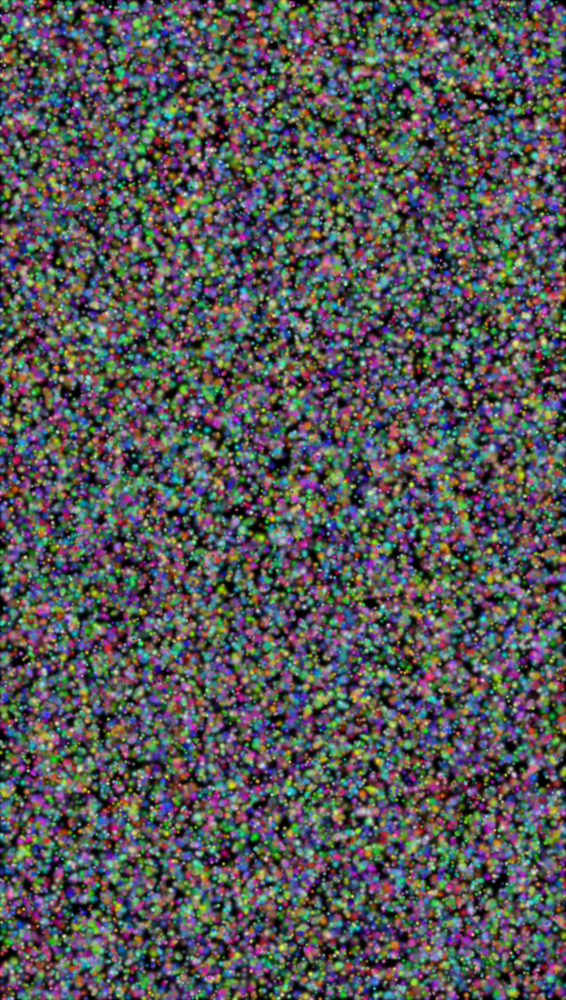
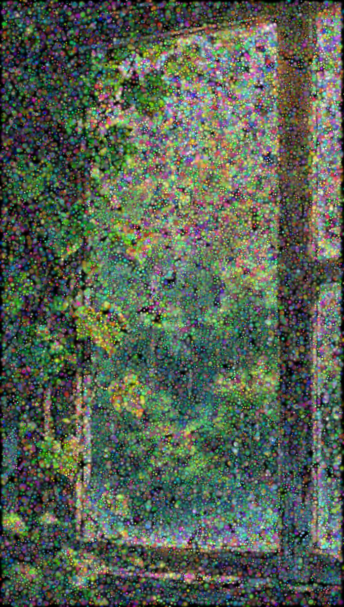
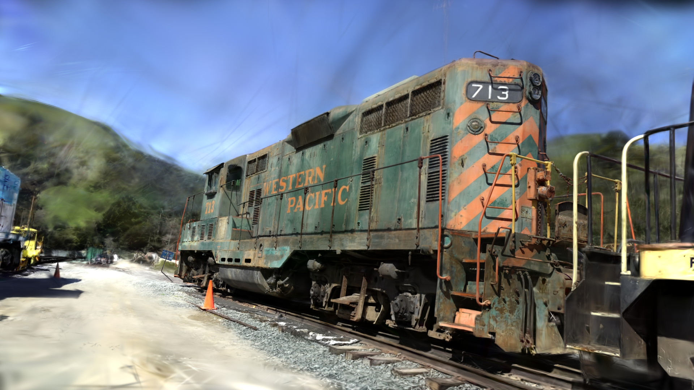

# diffsplat
A differentiable 3D Gaussian Splatting renderer written from scratch in CUDA, no PyTorch, no libtorch, no deep learning framework of any kind. Just raw GPU code.

Implements the full pipeline end-to-end on the GPU: tile-based forward rasterization, analytic backward pass with alpha-blending gradients, and Adam optimization. Inspired by
[3D Gaussian Splatting for Real-Time Radiance Field Rendering](https://repo-sam.inria.fr/fungraph/3d-gaussian-splatting/)
(Kerbl et al., SIGGRAPH 2023).

## TODO
- [ ] Density Control to adaptively split, clone and prune splats based on gradients
- [X] View-dependent SH colors (degrees 0-3) for viewer -- splats now have opinions about the lighting
- [ ] ~~SH colors for fitter so splats can finally have opinions about the lighting~~ yeah, no. Why would 2D image fitter need SH colors?
- [X] SH degree selector (0 to max) in viewer ImGui window
- [X] Maybe it's time to make the img fitter work in true 3D space with proper camera transforms(?)
- [X] Hate command line args; integrate proper file open buttons in the ImGui window -- viewer now has an Open PLY button
- [X] PLY file saving for fitter -- export fitted splats and view them in viewer
- [X] `getopt.h` doesn't exist on Windows, FIX IT
- [X] Build this on Windows
- [X] Fly Camera
- [X] Build a device for 3D feedforward rendering
- [X] World space to NDC layer with proper camera transforms
- [X] PLY file loading for feedforward 3DGS rendering
- [X] Make modular base app so specific purpose apps can build on top of it
- [X] Modularize the pipeline into "layers" for PyTorch-like code
- [X] Proper NDC to pixel space transform
- [X] Watch splats converge live
- [X] Adam optimizer
- [X] Backward pass (with transmittance division trick)

---

## Dependencies
- CUDA Toolkit 11.0+ (tested on 12.8, 13.0)
- OpenGL 3.3+ (provided by your GPU driver, no install needed)
- GLAD, stb_image, cxxopts, tinyfiledialogs (included in `include/` and `src/vendor/`)
- GLFW3, GLM, Dear ImGui, ImPlot (included as submodules in `third_party/`)

## Build
```sh
git clone --recurse-submodules https://github.com/SP5555/diffsplat.git
cd diffsplat
```

Or if already cloned without submodules:
```sh
git submodule update --init
```

### Linux

```sh
./build.sh
```

Or manually:
```sh
mkdir build && cd build
cmake .. -DCMAKE_BUILD_TYPE=Release [-DCMAKE_CUDA_ARCHITECTURES=89]
cmake --build . --parallel $(nproc)
```

### Windows

```bat
.\build.bat
```

Or manually:
```bat
mkdir build && cd build
cmake .. -G "Visual Studio 17 2022" -A x64 [-DCMAKE_CUDA_ARCHITECTURES=89]
cmake --build . --config Release --parallel
```

> Common architecture values: 75 = Turing (RTX 20xx), 86 = Ampere (RTX 30xx), 89 = Ada (RTX 40xx), 90 = Hopper, 120 = Blackwell (RTX 50xx)
> Not sure which one you have? `nvidia-smi` will tell you the GPU model. And look it up: https://developer.nvidia.com/cuda/gpus

---

## Apps

### fitter (Image Fitter)

Randomly initializes a cloud of 3D Gaussians and optimizes them toward a target image using gradient descent, fully on the GPU. Watch the splats converge **live** and export the result to a `.ply` file for viewing in viewer.

| Flag | Default | Description |
|------|---------|-------------|
| `--image` | REQUIRED | Path to target image (`.png` or `.jpg`) |
| `--width` | `1280` | Render window width in pixels |
| `--height` | `720` | Render window height in pixels |
| `--splats` | `60000` | Number of Gaussian splats |

> `--width` and `--height` must be specified together or not at all.

```sh
# Linux
./build/fitter --image path/to/image.png [--width 1280] [--height 720] [--splats 60000]

# Windows
.\build\Release\fitter --image path/to/image.png [--width 1280] [--height 720] [--splats 60000]
```

<p align="center">
  <table width="100%">
    <tr>
      <th width="25%">Initialization</th>
      <th width="25%">100 steps</th>
      <th width="25%">500 steps</th>
      <th width="25%">8000 steps</th>
    </tr>
    <tr>
      <td></td>
      <td></td>
      <td></td>
      <td></td>
    </tr>
  </table>
</p>

<p align="center">
  <table width="30%">
    <tr>
      <th width="100%">Progress over 4000 iterations (frames every 100)</th>
    </tr>
    <tr>
      <td>
        <p align="center">
          
        </p>
      </td>
    </tr>
  </table>
</p>

### viewer (PLY Scene Viewer)

Loads a pre-trained 3D Gaussian Splatting scene from a `.ply` file and renders it in real time with a free-orbit camera. Accepts any PLY file produced by standard 3DGS training pipelines. Automatically detects and evaluates spherical harmonic degrees 0-3 for view-dependent color -- orbit the camera and watch the colors change. The active SH degree can be changed live from the ImGui window.

| Flag | Default | Description |
|------|---------|-------------|
| `--scene` | _(none)_ | Path to `.ply` file -- if omitted, use the **Open PLY...** button in the UI |
| `--scale` | `1.0` | Scene normalization scale |
| `--camera` | `arcball` | Camera mode: `fly` or `arcball` |

```sh
# Linux
./build/viewer [--scene path/to/scene.ply] [--scale 1.0] [--camera fly|arcball]

# Windows
.\build\Release\viewer [--scene path/to/scene.ply] [--scale 1.0] [--camera fly|arcball]
```

<p align="center">
  
  <br><em><a href="https://huggingface.co/datasets/Voxel51/gaussian_splatting">Train Scene</a></em>
</p>

---

## Troubleshooting

### Submodules not initialized
If you see errors about missing GLM or ImGui headers:
```sh
git submodule update --init
```

### Black Screen / `named symbol not found` CUDA errors
Most likely a CUDA architecture mismatch.
If you're on an older or newer GPU, rebuild with the correct architecture manually:
```sh
rm -rf build            # nuke the broken build
mkdir build && cd build # go back in

cmake .. -DCMAKE_CUDA_ARCHITECTURES=75   # Turing    (RTX 20xx)
cmake .. -DCMAKE_CUDA_ARCHITECTURES=86   # Ampere    (RTX 30xx)
cmake .. -DCMAKE_CUDA_ARCHITECTURES=89   # Ada       (RTX 40xx)
cmake .. -DCMAKE_CUDA_ARCHITECTURES=120  # Blackwell (RTX 50xx)

cmake --build . # and compile
```
Not sure which architecture you need? Check https://developer.nvidia.com/cuda/gpus

### Hybrid GPU systems (Linux, e.g. AMD iGPU + NVIDIA dGPU)
By default the renderer falls back to a host-copy display path (GPU->CPU->GPU) since
CUDA and OpenGL are on different devices. To force direct GPU display:
```sh
__NV_PRIME_RENDER_OFFLOAD=1 __GLX_VENDOR_LIBRARY_NAME=nvidia ./build/viewer
```